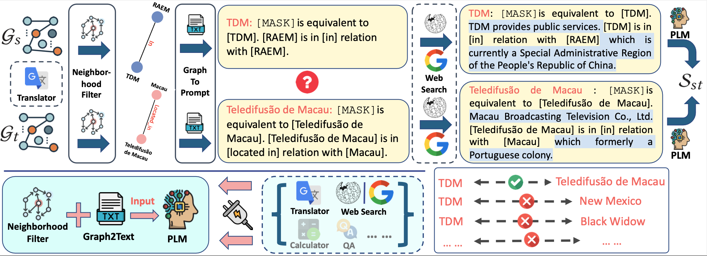

# ZeroEA: A Zero-Training Entity Alignment Framework via Pre-Trained Language Model (VLDB 2024 under review)
Nan Huo, Reynold Cheng, Ben Kao, Wentao Ning, Nur Al Hasan Haldar, Xiaodong Li, Jinyang Li, Tian Li, Mohammad Matin Najafi, Ge Qu  


[](https://www.python.org/downloads/release/python-390/)
[](https://pytorch.org/blog/pytorch-1.8-released/)
[](https://pypi.org/project/transformers/)
[](https://huggingface.co/bert-base-uncased)
[](https://drive.google.com/file/d/1Now8iTn37QYMOUC80swlBq9QKxKhFmSU/view)
[](https://github.com/nju-websoft/BootEA/tree/master/dataset/DWY100K)
[](https://yale-lily.github.io/spider)

<p align="center" width="100%">
<a></a>
</p>

## Overview
ZeroEA is a novel **zero-training** entity alignment framework for knowledge graphs. It bridges the gap between graph structure and plain text by converting KG topology into textual context suitable for PLM input. Additionally, in order to provide PLMs with concise and clear input text of reasonable length, we design a motif-based neighborhood
filter to eliminate noisy neighbors. Notably, ZeroEA can **outperform state-of-the-art supervised baselines**, and our study highlights the considerable potential of EA technique in improving the performance of downstream tasks, thereby benefitting the broader research field.


## Installation

### Create environment and download dependencies
• Please create the virtual environment and activate it through:
```bash
conda create -n zeroea python=3.7
source activate zeroea
```
• And then download the dependencies in **requirements.txt** file through:
```bash
pip install -r requirements.txt
```

## Quick Start


### Implementation Notes
The experiments were conducted on a GNU/Linux server with 8 NVIDIA GeForce RTX 2080 Ti GPU, and also 32 Intel(R) Xeon(R) Silver 4208 CPU @ 2.10GHz, 256G RAM.

### Data Source

The needed datasets are already in the folder. The DBP15K datasets can be downloaded from [here](https://drive.google.com/file/d/1Now8iTn37QYMOUC80swlBq9QKxKhFmSU/view) and DWY100K datasets from [here](https://github.com/nju-websoft/BootEA/tree/master/dataset/DWY100K).

### Dataset directory structure [1]
Take DBP15K (ZH-EN) as an example, the folder "zh_en" contains:
* all_attrs_range: the range code of attributes in source KG (ZH);
* ent_ILLs: all entity links (15K);
* rel_ILLs: all relationship links (with the same URI or localname);
* s_labels: cross-lingual entity labels of source KG (ZH);
* s_triples: relationship triples of source KG (ZH);
* sup_attr_pairs: all attribute links (with the same URI or localname);
* t_labels: cross-lingual entity labels of target KG (EN);
* t_triples: relationship triples of target KG (EN);
* training_attrs_1: entity attributes in source KG (ZH);
* training_attrs_2: entity attributes in target KG (EN);

### Dataset files [2]
Take the dataset "0_3" of DBP15K (ZH-EN) as an example, the folder "0_3" (means 30% training data split) contains:
* ent_ids_1: ids for entities in source KG (ZH);
* ent_ids_2: ids for entities in target KG (EN);
* ref_ent_ids: entity links encoded by ids for testing;
* ref_ents: URIs of entity links for testing;
* rel_ids_1: ids for relationships in source KG (ZH);
* rel_ids_2: ids for relationships in target KG (EN);
* sup_ent_ids: entity links encoded by ids for training;
* sup_rel_ids: relationship links encoded by ids for training;
* triples_1: relationship triples encoded by ids in source KG (ZH);
* triples_2: relationship triples encoded by ids in target KG (EN);

### Run Experiments

**To run ZeroEA without tool use**, please first go to **`run/`** folder and generate the discrete prompts as the input of BERT:
```bash
python3 ZeroEA_input_generate_undirected.py  ../data/DBP15K/zh_en/ text_input_no_train_11_wxt.txt text_input_no_train_22_wxt.txt False
```
You can change the file directory at the first parameter; the file names of the prompts of two KGs at the second and third parameters; and the tool use flag at the last parameter. Then run the encoding & eval code:
```bash
python3 ZeroEA_base.py ../data/DBP15K/zh_en/text_input_no_train_11_wxt.txt ../data/DBP15K/zh_en/text_input_no_train_22_wxt.txt > Output_ZeroEA_no_tool.txt
```
where the two parameters are the input prompts files directory.  


**To run ZeroEA with tool use**, please first generate the discrete prompts as the input of BERT:
```bash
python3 ZeroEA_input_generate_undirected.py  ../data/DBP15K/zh_en/ text_input_no_train_11_wxt.txt text_input_no_train_22_wxt.txt False
python3 ZeroEA_input_generate_undirected.py  ../data/DBP15K/zh_en/ text_input_no_train_11_wxt_KI.txt text_input_no_train_22_wxt_KI.txt True
```
You can change the file directory at the first parameter; the file names of the prompts of two KGs at the second and third parameters; and the tool use flag at the last parameter. Then run the encoding & eval code:
```bash
python3 ZeroEA_use_tool.py 80 ../data/DBP15K/zh_en/text_input_no_train_11_wxt_KI.txt ../data/DBP15K/zh_en/text_input_no_train_22_wxt_KI.txt ../data/DBP15K/zh_en/text_input_no_train_11_wxt.txt ../data/DBP15K/zh_en/text_input_no_train_22_wxt.txt > Output_ZeroEA_use_tool.txt
```
where the first parameter is the Rouge score threshold; the next two parameters are the input prompts (with tool use) files directory; the fourth and fifth parameters are the input prompts (without tool use) files directory.

Or you can run the bash file under the **`run/run.sh`** folder for your convenience. And the output will be in the **`run/Output_ZeroEA_use_tool.txt`**

**And to run all ablation studies**, please go to the folders named "ablation_*" and run the code accordingly. Some minor changes may be needed.

## Future Work
In this study, we are the first to explore the potential advantages
of incorporating Entity Alignment (EA) techniques to enhance
the performance of downstream tasks. A variety of tasks, such as
dialogue system and vision-based Question Answering (QA), could
significantly benefit from accurate entity alignment. For instance,
vision-based QA necessitates the recognition of Regions of Interest
(ROI) to enable the models to understand objects within the graph.
Thus, we aim to explore more complex downstream tasks, which
consider EA as the intermediate task, thereby initiating a novel
discussion on the influence of EA in complex and realistic scenarios.


## Reference
[1] https://github.com/nju-websoft/JAPE/tree/master  
[2] https://github.com/nju-websoft/BootEA/tree/master


